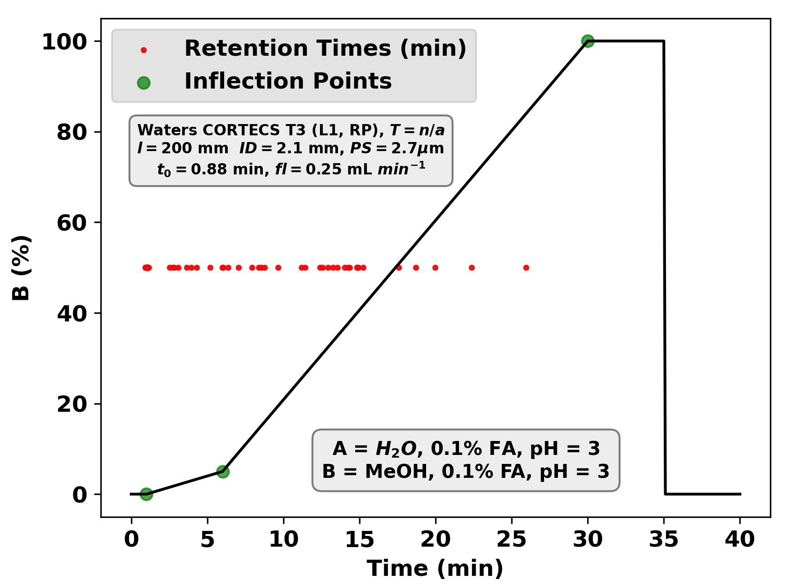

<p align="center">
  
</p>


# **ALIGNing Learned Representations: Domain-General Models Triangulate Physicochemical Interactions in Analytical Separations**

# General
ALIGN is an extension of our previous work, Graphormer-RT, and the Graphormer package. The [documentation](https://graphormer.readthedocs.io/) and the original code on [Github](https://github.com/microsoft/Graphormer/) contain additional usage examples. If you use this code, **please cite our work that led to the development of this platform and the original Graphormer**.

```bibtex
@article{Stienstra2025,
   author = {Cailum M.K. Stienstra and Emir Nazdrajić and W. Scott Hopkins},
   doi = {10.1021/ACS.ANALCHEM.4C05859},
   issn = {15206882},
   journal = {Analytical Chemistry},
   publisher = {American Chemical Society},
   title = {From Reverse Phase Chromatography to HILIC: Graph Transformers Power Method-Independent Machine Learning of Retention Times},
   url = {https://pubs.acs.org/doi/abs/10.1021/acs.analchem.4c05859},
   year = {2025},
}

@article{Stienstra2025,
   author = {Cailum M.K. Stienstra and Teun van Wieringen and Liam Hebert and Patrick Thomas and Kas J. Houthuijs and Giel Berden and Jos Oomens and Jonathan Martens and W. Scott Hopkins},
   doi = {10.1021/ACS.JCIM.4C02329},
   issn = {1549960X},
   journal = {Journal of Chemical Information and Modeling},
   publisher = {American Chemical Society},
   title = {A Machine-Learned “Chemical Intuition” to Overcome Spectroscopic Data Scarcity},
   volume = {65},
   url = {https://pubs.acs.org/doi/full/10.1021/acs.jcim.4c02329},
   year = {2025},
}

@article{Stienstra2024,
   author = {Cailum M. K. Stienstra and Liam Hebert and Patrick Thomas and Alexander Haack and Jason Guo and W. Scott Hopkins},
   doi = {10.1021/ACS.JCIM.4C00378},
   issn = {1549-9596},
   journal = {Journal of Chemical Information and Modeling},
   month = {6},
   publisher = {American Chemical Society},
   title = {Graphormer-IR: Graph Transformers Predict Experimental IR Spectra Using Highly Specialized Attention},
   url = {https://pubs.acs.org/doi/abs/10.1021/acs.jcim.4c00378},
   year = {2024},
}

@inproceedings{
ying2021do,
title={Do Transformers Really Perform Badly for Graph Representation?},
author={Chengxuan Ying and Tianle Cai and Shengjie Luo and Shuxin Zheng and Guolin Ke and Di He and Yanming Shen and Tie-Yan Liu},
booktitle={Thirty-Fifth Conference on Neural Information Processing Systems},
year={2021},
url={https://openreview.net/forum?id=OeWooOxFwDa}
}
```

# Installation

To take the headache out of environment management, we’ve provided a pre-configured Docker Image for ALIGN. We recommend using **VS Code Dev Containers**; it gives you a full graphical interface to interact with the containerized code and files just like a local project, all while maintaining full GPU support. You can find a beginner's guide to [Docker](https://docker-curriculum.com/) and [Dev Containers](https://code.visualstudio.com/docs/devcontainers/containers) if you want to learn more about the basics. 

### 🧰 Prerequisites

- [Docker](https://docs.docker.com/get-started/get-docker/)
- [Visual Studio Code (VS Code)](https://code.visualstudio.com/)
- [Dev Containers Extension](https://marketplace.visualstudio.com/items?itemName=ms-vscode-remote.remote-containers)
- Access to a machine with [**NVIDIA GPU**](https://docs.nvidia.com/datacenter/cloud-native/container-toolkit/install-guide.html) and [drivers](https://www.nvidia.com/Download/index.aspx) properly installed

You can verify Docker and NVIDIA installation via the following commands:
```bash
docker --version
```
```bash
nvidia-smi
```
```bash
nvidia-container-cli --version
```

To find your active `<container_id>`, run `docker ps`.

Since Dev Containers allow you to drag-and-drop or edit files directly through the VS Code sidebar, you won't need the command line for most tasks. However, if you ever need to quickly move data or results via the terminal, you can use these "just in case" commands:
- To **UPLOAD** files (_e.g._, new data) to the docker container:
```bash
docker cp <path_to_local_file> <container_id>:<destination_directory_inside_container>
```
- To **DOWNLOAD** files (_e.g._, checkpoints, results) from this container, use:
```bash
docker cp <container_id>:<path_inside_container> <path_on_host>
```

### 📁 Folder Structure

Your main project folder (e.g. `ALIGN/`) should look like this:

<pre lang="markdown"> <code> ALIGN/ 
  ├── .devcontainer/        ← From 'git_clone_installation' or 'local_mount_installation' (see below)
  │ ├── devcontainer.json    
  │ ├── Dockerfile 
  │ └── setup.sh            ← Only if mounting from local download       
  ├── ALIGN_repo/           ← The project code (from cloning GitHub or manual download) 
  ├── ALIGN_Weights/         </code> </pre>

### 🚀 Setup Steps

#### 1. Clone or download this repository

You may choose to **download** and extract the repository manually. Place it inside `ALIGN/` (here named `ALIGN_repo/`) for local mounting when we build the docker container.

Alternatively, you may also choose to **clone** it automatically via `git clone`.

#### 2. Prepare the `.devcontainer` folder

Please note that installation steps slightly differ depending on whether you're cloning from GitHub or mounting the repository locally. Use the files in `git_clone_installation/` or `local_mount_installation/` accordingly. Create a `.devcontainer/` folder inside the big `ALIGN/` directory with the following files:
- `devcontainer.json` 
- `Dockerfile`
- `setup.sh` (optional, only if you're mounting from a local download)
  
#### 3. Prepare model weights

Download our model weights from XXXX and place them in an `ALIGN_Weights/` folder inside `ALIGN/`. If everything is installed correctly, there would be a bind mount for the weights to the container under `/workspace/align/model_weights/`.

#### 4. Open Container in VS Code

1. In VS Code, install the **Dev Containers extension** if you haven't already.
3. Open the `ALIGN/` folder in a **new window**.
4. Press `F1` and select:
   
   ➜ `Dev Containers: Reopen in Container`

   **NOTE:** If the environment is broken and you need to rebuild, select `Dev Containers: Rebuild Container without Cache and Reopen in Container`.
   
6. Once the container finishes building, run `bash setup.sh` to finish setting up the environment (if mounting locally).
7. Navigate to the example directory and run the example script:
   
   ```bash
   cd examples/property_prediction
   bash HILIC.sh
   ```
8. If it runs for an epoch and saves .pt files inside `checkpoints_HILIC/`, you know you’ve succeeded.

# Data and Chromatographic Gradients
All in-house benchmarking datasets in this study are publically available at **INSERT ZENODO LINK WHEN AVAILABLE**.

All data used to pretrain the RP specialist and fused ALIGN models are publically available at the [RepoRT GitHub](https://github.com/michaelwitting/RepoRT/). Those using these data should cite this work as follows:

```bibtex
@article{Kretschmer2024,
   author = {Fleming Kretschmer and Eva Maria Harrieder and Martin A. Hoffmann and Sebastian Böcker and Michael Witting},
   doi = {10.1038/s41592-023-02143-z},
   issn = {1548-7105},
   issue = {2},
   journal = {Nature Methods 2024 21:2},
   keywords = {Analytical biochemistry,Databases,Metabolomics},
   month = {1},
   pages = {153-155},
   pmid = {38191934},
   publisher = {Nature Publishing Group},
   title = {RepoRT: a comprehensive repository for small molecule retention times},
   volume = {21},
   url = {https://www.nature.com/articles/s41592-023-02143-z},
   year = {2024},
}
```

The visualization below illustrates how the model interprets chromatographic gradients. Red dots indicate experimental retention times, while green markers identify gradient inflection points. Additional column parameters, derived using the RepoRT workflow, are also shown.

The void volume ($t_0$), for instance, is determined by:

$$t_0 = \frac{0.0005 \cdot l \cdot ID^2}{fl}$$

where $l$ is the column length (mm), $ID$ is the column inner diameter (mm), and $fl$ is the flow rate (mL/min).

<p align="center">
  
</p>

To support downstream fine-tuning, we have provided a utility script (`scripts/update_method_dictionary.py`) to append new gradients to our method dictionary (`sample_data/all_col_metadata_20260512.pickle`). This file includes consolidated column metadata, including RepoRT-calculated metrics like $t_0$ and HSMB/Tanaka parameters, structured with the following headers:

```python
['company_name', 'usp_code', 'col_length', 'col_innerdiam', 'col_part_size', 'temp', 'col_fl', 'col_dead', 'HPLC_type','A_solv', 'B_solv', 'time1', 'grad1', 'time2', 'grad2', 'time3', 'grad3', 'time4', 'grad4', 'A_pH', 'B_pH', 'A_start', 'A_end', 'B_start', 'B_end',  'eluent_A_formic', 'eluent_A_formic_unit', 'eluent_A_acetic', 'eluent_A_acetic_unit','eluent_A_trifluoroacetic', 'eluent_A_trifluoroacetic_unit','eluent_A_phosphor', 'eluent_A_phosphor_unit','eluent_A_nh4ac','eluent_A_nh4ac_unit', 'eluent_A_nh4form','eluent_A_nh4form_unit','eluent_A_nh4carb', 'eluent_A_nh4carb_unit','eluent_A_nh4bicarb','eluent_A_nh4bicarb_unit', 'eluent_A_nh4f','eluent_A_nh4f_unit','eluent_A_nh4oh', 'eluent_A_nh4oh_unit','eluent_A_trieth','eluent_A_trieth_unit','eluent_A_triprop','eluent_A_triprop_unit','eluent_A_tribut', 'eluent_A_tribut_unit','eluent_A_nndimethylhex', 'eluent_A_nndimethylhex_unit','eluent_A_medronic', 'eluent_A_medronic_unit','eluent_B_formic', 'eluent_B_formic_unit', 'eluent_B_acetic', 'eluent_B_acetic_unit','eluent_B_trifluoroacetic', 'eluent_B_trifluoroacetic_unit','eluent_B_phosphor', 'eluent_B_phosphor_unit','eluent_B_nh4ac','eluent_B_nh4ac_unit', 'eluent_B_nh4form','eluent_B_nh4form_unit','eluent_B_nh4carb', 'eluent_B_nh4carb_unit','eluent_B_nh4bicarb','eluent_B_nh4bicarb_unit', 'eluent_B_nh4f','eluent_B_nh4f_unit','eluent_B_nh4oh', 'eluent_B_nh4oh_unit','eluent_B_trieth','eluent_B_trieth_unit', 'eluent_B_triprop','eluent_B_triprop_unit','eluent_B_tribut', 'eluent_B_tribut_unit','eluent_B_nndimethylhex', 'eluent_B_nndimethylhex_unit','eluent_B_medronic', 'eluent_B_medronic_unit', 'kPB', 'alpha_CH2', 'alpha_T_O', 'alpha_C_P', 'alpha_B_P', 'alpha_B_P1', 'particle_size', 'pore_size', 'H', 'S_star', 'A', 'B', 'C_pH_28)', 'C_pH_7)', 'EB_ret_factor']
```


# Usage
Sample data for generating 'RP specialist' and 'fused' models are found in the ```sample_data/``` folder and demonstrates the intended structure. RP specialist models have 64 attention heads, while fused models have 128.

The ```example/property_prediction/``` folder contains scripts and dataloaders to a) pre-train a model and b) finetune a pre-existing model. If you want to change the data source, you will need to edit code in the dataloader. Details for recommended hyperparameters are found in the Supplementary Information XXXXXXX.

To fully pre-train a model, use the following scripts. Adjust ```--encoder-attention-heads``` to 64 for an RP specialist model and 128 for a fused model:
```bash
bash ../../examples/property_prediction/pretrain_fused.sh  # also, pretrain_RP.sh
```

To finetune a model, use the following script. Ensure that you have the correct paths for ```--pretrained-model-name``` and ```--finetune_from_model```:
```bash
bash ../../examples/property_prediction/RP.sh  # also, CCS.sh, DMS.sh, GC.sh, fused.sh
```

Models can then be evaluated using the corresponding scripts in ```graphormer/evaluate/```. The flag ```--save-dir``` will allow you to save predictions alongside method data and SMILES strings:
```bash
bash ../../graphormer/evaluate_RP.sh  # also, evaluate_CCS.sh, evaluate_DMS.sh, evaluate_GC.sh, evaluate_fused.sh
```

Pre-graph encoders are found in ```graphormer/modules/graphormer_layers.py```. Graph layers and MLPs are found in ```graphormer/models/```.

There are command line tools available for freezing layers of the graph encoder of MLP (see ```--freeze-level```). A negative freeze-level will freeze layers of the graph encoder starting from the front (-4 freezes the first 4 layers of the graph encoder). A positive freeze level will freeze layers in the MLP starting from the front (2 will freeze the first two layers of the MLP). There are additional flags for freezing the atomic feature encoders and graph feature encoders.

# Models

Sample RP and HILIC models that were pretrained for our study are freely available online at XXXXXXX. These can be used for model evaluation or for finetuning using the requisite scripts. 

# Common Errors

"Segmentation Fault... Core Dumped" may indicate that you have installed the incorrect version of [PyTorch Geometric](https://data.pyg.org/whl/). This can be further tested by checking the package import (_e.g._, ```from pytorch_geometric.data import data```)

If gradients explode in training, it is recommended that you lower learning rates or increase the ```fp16-scale-tolerance``` value in the bash script

# Contact

If you require further assistance with developing your own model or have any questions about its implementaton, the authors can be contacted at 

- cmkstien@uwaterloo.ca
- scott.hopkins@uwaterloo.ca 

